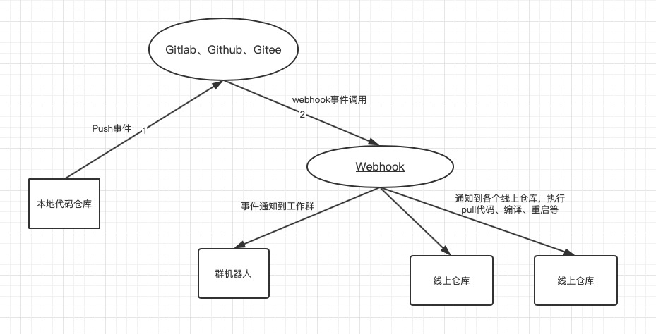

# 部署方案

解放人力，实现自动化。

## Webhook

启动一个 proxy 程序。监听远端仓库的 push 事件。

有事件过来时，一方面通知群机器人，另一方面通知各个节点 仓库触发事件，成功与否返回proxy 通知到群机器人，失败后人工操作。

### 节点功能

监听 proxy 下发的事件，调用本地shell脚本，拉取远端最新文件。

```
#!/bin/bash
cd xxx/xx/x
git checkout .
git pull origin master

```

实现多台物理机仓库文件同步，解决人工登陆各服务器拉取代码。

### 工作流程图



## 部署仓库

```
teacher/
├── service 服务端程序目录
│   ├── info.json  服务器程序信息（版号，时间）
│   └── 二进制文件
├── asset 资源文件目录
│   ├── info.json  资源文件信息（版号，时间）
│   └── 资源（）
└── 其他
```

### 二进制文件

在本地编译 linux 下的二进制文件，统一将其放到指定目录。

### 资源文件

由策划更新，上传到指定目录

### 版本号

- 服务程序版本号，可根据情况配置上时间、编译人等。
- 资源版本号，同上

```
{
  "version_code": 1.1.1,
  "version_name": "1.1.1",
  "time": "2020-03-16 08:00:00",
}
```

## 部署启动平台

已由上面步骤实现各节点的 执行程序、资源文件的更新。

平台功能，显示当前运行程序、资源文件的版本号。由管理员负责开服、停服、更新配置等操作。


